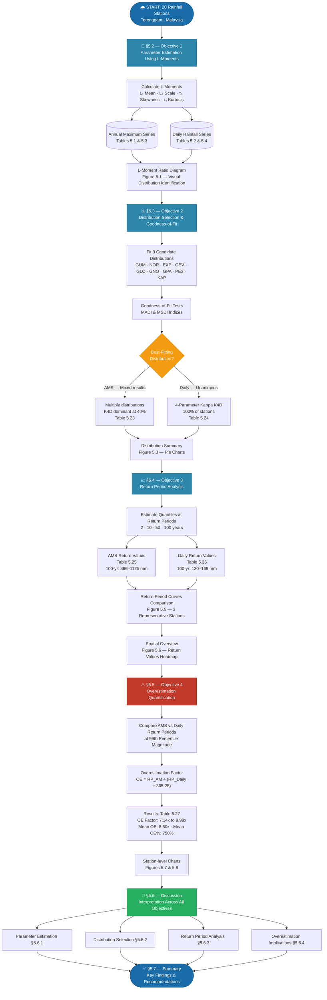

# CHAPTER 5: RESULTS AND DISCUSSION

## 5.1 Introduction

This chapter presents the results of the L-moments flood frequency analysis conducted on twenty rainfall stations in Terengganu, Malaysia. The methodology described in Chapter 3 was applied to address the four research objectives. Results are presented for both Annual Maximum Series (AMS) and daily rainfall data.

### Chapter 5 — Reader's Guide

The flowchart below outlines the logical flow of this chapter. Each section builds upon the previous one, progressing from parameter estimation through to the final overestimation quantification.

---

## 5.2 Objective 1: Parameter Estimation Using L-Moments

### 5.2.1 L-Moments for Annual Maximum Series

Table 5.1 presents the L-moment statistics for all twenty stations.

**Table 5.1: L-Moment Statistics for Annual Maximum Series**

| Station ID | Station Name | N | L₁ (Mean) | L₂ (Scale) | τ₃ (L-Skewness) | τ₄ (L-Kurtosis) |
|------------|--------------|---|-----------|------------|-----------------|-----------------|
| 0551621RF | Stor JPS Kuala Terengganu | 34 | 215.06 | 42.34 | 0.0663 | 0.1781 |
| 0580041RF | Klinik Bidan Kg. Baru Ajil | 37 | 214.79 | 62.37 | 0.4666 | 0.3835 |
| 0600011RF | JPS Bukit Besi | 51 | 204.43 | 45.75 | 0.1913 | 0.1467 |
| 0600131RF | JPS Dungun | 30 | 224.34 | 46.02 | 0.0615 | 0.1777 |
| 0600141RF | Rumah Pam Paya Ketam | 34 | 197.83 | 43.98 | 0.1072 | 0.0954 |
| 0600151RF | JPS Kuala Dungun | 36 | 194.89 | 48.28 | 0.3254 | 0.2606 |
| 0620081RF | Rumah Pam Nyatoh | 41 | 241.32 | 56.44 | 0.1358 | 0.1717 |
| 0630011RF | JPS Kemaman | 51 | 205.46 | 56.54 | 0.3630 | 0.3075 |
| 0630121RF | JPS Kg. Ibok, Kemaman | 33 | 217.38 | 53.61 | 0.1947 | 0.0191 |
| 0670051RF | Rumah Pam Tok Sabah, Marang | 45 | 202.48 | 46.97 | 0.1752 | 0.1586 |
| 0670181RF | Kg. Tepuh, Hulu Terengganu | 43 | 225.63 | 56.36 | 0.1290 | 0.1085 |
| 0670211RF | Rumah Pam Padang Landak | 41 | 213.23 | 39.24 | 0.0241 | 0.0859 |
| 0670221RF | JPS Kuala Berang | 48 | 250.02 | 64.93 | 0.2012 | 0.2253 |
| 0670251RF | Rumah Pam Jerangau | 45 | 230.93 | 59.19 | 0.0902 | 0.0773 |
| 0670281RF | Kg. Menerong, Hulu Terengganu | 35 | 244.58 | 73.69 | 0.1542 | 0.0320 |
| 0680071RF | Balai Polis Kg. Dura | 35 | 289.65 | 91.25 | 0.3827 | 0.3436 |
| 0680081RF | Rumah Pam Rantau Petronas | 43 | 222.20 | 45.53 | 0.0314 | 0.0363 |
| 0690051RF | Rumah Pam Pengkalan Ranggon | 36 | 252.72 | 69.07 | 0.3171 | 0.2231 |
| 0700011RF | Rumah Pam Besut | 39 | 251.68 | 77.43 | 0.3835 | 0.3652 |
| 0700131RF | JPS Jertih, Besut | 32 | 284.87 | 80.51 | 0.1102 | 0.0659 |

**Key Findings:**
- L₁ (mean) ranges from 194.89 to 289.65 mm
- L₂ (scale) ranges from 39.24 to 91.25 mm
- L-skewness (τ₃) is predominantly positive, ranging from 0.024 to 0.467
- L-kurtosis (τ₄) ranges from 0.019 to 0.384

### 5.2.2 L-Moments for Daily Rainfall Series

**Table 5.2: L-Moment Statistics for Daily Rainfall Series**

| Station ID | N | L₁ (Mean) | L₂ (Scale) | τ₃ (L-Skewness) | τ₄ (L-Kurtosis) |
|------------|---|-----------|------------|-----------------|-----------------|
| 0551621RF | 6,391 | 18.76 | 11.38 | 0.5052 | 0.2988 |
| 0580041RF | 5,062 | 20.29 | 12.86 | 0.5446 | 0.3352 |
| 0600011RF | 9,311 | 19.25 | 12.23 | 0.5462 | 0.3325 |
| 0600131RF | 6,185 | 20.01 | 12.12 | 0.5045 | 0.3012 |
| 0600141RF | 6,161 | 19.52 | 11.67 | 0.4957 | 0.2915 |
| 0600151RF | 7,087 | 19.61 | 11.52 | 0.4715 | 0.2637 |
| 0620081RF | 8,110 | 20.88 | 12.56 | 0.5005 | 0.3033 |
| 0630011RF | 9,651 | 18.89 | 11.75 | 0.5269 | 0.3128 |
| 0630121RF | 6,169 | 20.57 | 12.34 | 0.4964 | 0.2936 |
| 0670051RF | 6,631 | 19.23 | 12.14 | 0.5418 | 0.3277 |
| 0670181RF | 8,555 | 19.78 | 12.11 | 0.5121 | 0.3089 |
| 0670211RF | 8,260 | 20.21 | 12.22 | 0.4990 | 0.2965 |
| 0670221RF | 9,345 | 20.35 | 12.37 | 0.5017 | 0.2994 |
| 0670251RF | 8,458 | 21.28 | 12.93 | 0.5105 | 0.3093 |
| 0670281RF | 6,206 | 20.99 | 13.00 | 0.5273 | 0.3310 |
| 0680071RF | 7,683 | 23.43 | 13.99 | 0.4892 | 0.2921 |
| 0680081RF | 7,620 | 21.43 | 12.87 | 0.4980 | 0.2933 |
| 0690051RF | 5,965 | 22.13 | 13.68 | 0.5266 | 0.3242 |
| 0700011RF | 5,740 | 20.68 | 12.87 | 0.5344 | 0.3303 |
| 0700131RF | 5,182 | 20.14 | 12.70 | 0.5470 | 0.3441 |

**Key Findings:**
- L₁ ranges from 18.76 to 23.43 mm (much lower than annual maxima)
- L-skewness (τ₃) is consistently high (0.472 to 0.547), indicating right-skewed distributions
- Daily data shows more consistent L-moment patterns across stations

### 5.2.3 L-Moment Ratio Diagram

**Figure 5.1:** L-Moment Ratio Diagram comparing Annual Maximum Series (blue circles) and Daily Rainfall Series (red squares) with theoretical distribution curves. The theoretical curves represent the relationship between L-skewness (τ₃) and L-kurtosis (τ₄) for different probability distributions: Gumbel (GUM), Normal (NOR), Exponential (EXP), Generalized Extreme Value (GEV), Generalized Logistic (GLO), Generalized Normal (GNO), Generalized Pareto (GPA), Pearson Type III (PE3), and 4-Parameter Kappa (K4D). These curves help identify which theoretical distributions are most appropriate for the observed data by showing where the empirical data points fall relative to the theoretical relationships.

**Key Observations:**
- **Annual Maximum Series data points** (blue circles) are scattered across a wider range of L-skewness (0.02 to 0.47) and L-kurtosis (0.02 to 0.38), indicating greater variability in distribution shapes across stations.
- **Daily Rainfall Series data points** (red squares) cluster tightly in a high L-skewness region (0.47-0.55) with L-kurtosis values between 0.26 and 0.34, demonstrating consistent distributional characteristics across all stations.
- **Theoretical Distribution Curves**: The empirical data points for Daily Rainfall Series fall closest to the 4-Parameter Kappa (K4D) distribution curve, which is consistent with the goodness-of-fit results showing K4D as the best-fitting distribution for all daily rainfall stations. The Annual Maximum Series points are more dispersed, with some stations near GLO, GNO, PE3, and K4D curves, reflecting the diversity of best-fitting distributions identified through MADI/MSDI analysis.
- **Distribution Selection Validation**: The proximity of empirical points to theoretical curves provides visual confirmation of the distribution selection results, where K4D was selected for all daily stations, while Annual Maximum stations showed more variation (K4D, GLO, PE3, GNO, GPA, and GEV).

### 5.2.4 Distribution Parameter Estimation

Following the calculation of L-moments, distribution parameters were estimated for all nine candidate distributions using the method of L-moments. The estimated parameters are essential for subsequent goodness-of-fit testing and distribution selection.

#### 5.2.4.1 Best-Fitting Distribution Parameters

The estimated parameters for the best-fitting distributions (identified through MADI/MSDI goodness-of-fit testing) are presented in Tables 5.5 and 5.6. These parameters were estimated using the method of L-moments as described in Chapter 3.

**Table 5.3: Estimated Parameters for Best-Fitting Distributions (Annual Maximum Series)**

| Station ID | Station Name | Distribution | Parameter 1 | Parameter 2 | Parameter 3 | Parameter 4 |
|------------|--------------|-------------|-------------|-------------|-------------|-------------|
| 0551621RF | Stor JPS Kuala Terengganu | PE3 | loc = 215.06 | scale = 75.44 | skew = 0.4063 | - |
| 0580041RF | Klinik Bidan Kg. Baru Ajil | GEV | loc = 150.38 | scale = 50.89 | - | - |
| 0600011RF | JPS Bukit Besi | K4D | loc = 158.98 | scale = 70.68 | k = 0.0118 | h = 0.1582 |
| 0600131RF | JPS Dungun | PE3 | loc = 224.34 | scale = 81.94 | skew = 0.3771 | - |
| 0600141RF | Rumah Pam Paya Ketam | K4D | loc = 146.46 | scale = 91.81 | k = 0.2433 | h = 0.3573 |
| 0600151RF | JPS Kuala Dungun | GLO | loc = 170.36 | scale = 40.30 | k = -0.3254 | - |
| 0620081RF | Rumah Pam Nyatoh | GNO | loc = 227.54 | scale = 96.85 | k = -0.2791 | - |
| 0630011RF | JPS Kemaman | GLO | loc = 173.82 | scale = 45.06 | k = -0.3630 | - |
| 0630121RF | JPS Kg. Ibok, Kemaman | K4D | loc = -65.33 | scale = 400.17 | k = 0.7719 | h = 1.6802 |
| 0670051RF | Rumah Pam Tok Sabah, Marang | PE3 | loc = 202.48 | scale = 86.24 | skew = 1.0630 | - |
| 0670181RF | Kg. Tepuh, Hulu Terengganu | GPA | loc = 82.30 | scale = 221.17 | c = -0.5431 | - |
| 0670211RF | Rumah Pam Padang Landak | K4D | loc = 176.56 | scale = 83.70 | k = 0.3575 | h = 0.2390 |
| 0670221RF | JPS Kuala Berang | GNO | loc = 226.77 | scale = 107.08 | k = -0.4157 | - |
| 0670251RF | Rumah Pam Jerangau | K4D | loc = 150.83 | scale = 143.56 | k = 0.3418 | h = 0.4815 |
| 0670281RF | Kg. Menerong, Hulu Terengganu | K4D | loc = 1.01 | scale = 358.16 | k = 0.6172 | h = 1.2381 |
| 0680071RF | Balai Polis Kg. Dura | GLO | loc = 236.22 | scale = 70.80 | k = -0.3827 | - |
| 0680081RF | Rumah Pam Rantau Petronas | K4D | loc = 136.97 | scale = 164.13 | k = 0.6443 | h = 0.7154 |
| 0690051RF | Rumah Pam Pengkalan Ranggon | K4D | loc = 184.77 | scale = 79.47 | k = -0.2098 | h = 0.0405 |
| 0700011RF | Rumah Pam Besut | GLO | loc = 206.26 | scale = 60.01 | k = -0.3835 | - |
| 0700131RF | JPS Jertih, Besut | GPA | loc = 75.31 | scale = 335.91 | c = -0.6029 | - |

*Note: Parameter notation: loc = location parameter, scale = scale parameter, k = shape parameter (for GEV, GLO, GNO, K4D), h = second shape parameter (4-Parameter Kappa distribution only), skew = skewness parameter (Pearson Type III), c = shape parameter (Generalized Pareto). For GEV distribution at station 0580041RF, the shape parameter k approaches zero, indicating a Gumbel-like distribution.*

**Table 5.4: Estimated Parameters for 4-Parameter Kappa Distribution (Daily Rainfall Series)**

| Station ID | Station Name | Location (loc) | Scale (scale) | Shape 1 (k) | Shape 2 (h) |
|------------|--------------|---------------|---------------|-------------|-------------|
| 0551621RF | Stor JPS Kuala Terengganu | -5.66 | 15.93 | -0.2596 | 1.4743 |
| 0580041RF | Klinik Bidan Kg. Baru Ajil | -7.78 | 16.44 | -0.3132 | 1.6412 |
| 0600011RF | JPS Bukit Besi | -8.83 | 16.38 | -0.2993 | 1.7428 |
| 0600131RF | JPS Dungun | -5.10 | 16.42 | -0.2701 | 1.4105 |
| 0600141RF | Rumah Pam Paya Ketam | -5.07 | 16.46 | -0.2509 | 1.4142 |
| 0600151RF | JPS Kuala Dungun | -6.34 | 18.50 | -0.1899 | 1.4547 |
| 0620081RF | Rumah Pam Nyatoh | -3.57 | 16.17 | -0.2846 | 1.2879 |
| 0630011RF | JPS Kemaman | -8.27 | 16.72 | -0.2675 | 1.6823 |
| 0630121RF | JPS Kg. Ibok, Kemaman | -5.04 | 17.11 | -0.2571 | 1.3901 |
| 0670051RF | Rumah Pam Tok Sabah, Marang | -8.80 | 16.56 | -0.2908 | 1.7364 |
| 0670181RF | Kg. Tepuh, Hulu Terengganu | -5.18 | 15.99 | -0.2834 | 1.4232 |
| 0670211RF | Rumah Pam Padang Landak | -4.98 | 16.72 | -0.2632 | 1.3860 |
| 0670221RF | JPS Kuala Berang | -5.06 | 16.74 | -0.2688 | 1.3864 |
| 0670251RF | Rumah Pam Jerangau | -4.82 | 16.79 | -0.2878 | 1.3815 |
| 0670281RF | Kg. Menerong, Hulu Terengganu | -3.74 | 15.20 | -0.3319 | 1.3190 |
| 0680071RF | Balai Polis Kg. Dura | -4.09 | 18.75 | -0.2643 | 1.2757 |
| 0680081RF | Rumah Pam Rantau Petronas | -5.80 | 18.11 | -0.2532 | 1.4271 |
| 0690051RF | Rumah Pam Pengkalan Ranggon | -5.64 | 17.09 | -0.3101 | 1.4401 |
| 0700011RF | Rumah Pam Besut | -5.85 | 15.98 | -0.3165 | 1.4958 |
| 0700131RF | JPS Jertih, Besut | -5.64 | 14.99 | -0.3399 | 1.5092 |

*Note: All daily rainfall series use the 4-Parameter Kappa (K4D) distribution. The 4-Parameter Kappa distribution is a four-parameter distribution with location (loc), scale, and two shape parameters (k and h).*

#### 5.2.4.2 Comprehensive Parameter Tables for All Distributions

The following tables present estimated parameters for all nine distributions fitted to both Annual Maximum Series and Daily Rainfall Series data. These comprehensive tables provide complete parameter information for all distributions, allowing for comparison and reference. Parameters were estimated using the method of L-moments as described in Chapter 3.

**Table 5.5: Estimated Parameters for GUM Distribution (Annual Maximum Series)**

| Station ID | Station Name | Location (loc) | Scale (scale) |
|------------|--------------|---------------|---------------|
| 0551621RF | Stor JPS Kuala Terengganu | 179.80 | 61.09 |
| 0580041RF | Klinik Bidan Kg. Baru Ajil | 162.84 | 89.99 |
| 0600011RF | JPS Bukit Besi | 166.33 | 66.00 |
| 0600131RF | JPS Dungun | 186.01 | 66.40 |
| 0600141RF | Rumah Pam Paya Ketam | 161.21 | 63.45 |
| 0600151RF | JPS Kuala Dungun | 154.68 | 69.66 |
| 0620081RF | Rumah Pam Nyatoh | 194.32 | 81.43 |
| 0630011RF | JPS Kemaman | 158.37 | 81.57 |
| 0630121RF | JPS Kg. Ibok, Kemaman | 172.74 | 77.34 |
| 0670051RF | Rumah Pam Tok Sabah, Marang | 163.36 | 67.77 |
| 0670181RF | Kg. Tepuh, Hulu Terengganu | 178.69 | 81.31 |
| 0670211RF | Rumah Pam Padang Landak | 180.56 | 56.61 |
| 0670221RF | JPS Kuala Berang | 195.95 | 93.67 |
| 0670251RF | Rumah Pam Jerangau | 181.64 | 85.40 |
| 0670281RF | Kg. Menerong, Hulu Terengganu | 183.21 | 106.32 |
| 0680071RF | Balai Polis Kg. Dura | 213.66 | 131.64 |
| 0680081RF | Rumah Pam Rantau Petronas | 184.28 | 65.68 |
| 0690051RF | Rumah Pam Pengkalan Ranggon | 195.20 | 99.64 |
| 0700011RF | Rumah Pam Besut | 187.20 | 111.71 |
| 0700131RF | JPS Jertih, Besut | 217.82 | 116.15 |

**Table 5.6: Estimated Parameters for NOR Distribution (Annual Maximum Series)**

| Station ID | Station Name | Location (loc) | Scale (scale) |
|------------|--------------|---------------|---------------|
| 0551621RF | Stor JPS Kuala Terengganu | 215.06 | 75.05 |
| 0580041RF | Klinik Bidan Kg. Baru Ajil | 214.79 | 110.56 |
| 0600011RF | JPS Bukit Besi | 204.43 | 81.08 |
| 0600131RF | JPS Dungun | 224.34 | 81.57 |
| 0600141RF | Rumah Pam Paya Ketam | 197.83 | 77.95 |
| 0600151RF | JPS Kuala Dungun | 194.89 | 85.58 |
| 0620081RF | Rumah Pam Nyatoh | 241.32 | 100.05 |
| 0630011RF | JPS Kemaman | 205.46 | 100.22 |
| 0630121RF | JPS Kg. Ibok, Kemaman | 217.38 | 95.02 |
| 0670051RF | Rumah Pam Tok Sabah, Marang | 202.48 | 83.26 |
| 0670181RF | Kg. Tepuh, Hulu Terengganu | 225.63 | 99.89 |
| 0670211RF | Rumah Pam Padang Landak | 213.23 | 69.55 |
| 0670221RF | JPS Kuala Berang | 250.02 | 115.08 |
| 0670251RF | Rumah Pam Jerangau | 230.93 | 104.91 |
| 0670281RF | Kg. Menerong, Hulu Terengganu | 244.58 | 130.62 |
| 0680071RF | Balai Polis Kg. Dura | 289.65 | 161.73 |
| 0680081RF | Rumah Pam Rantau Petronas | 222.20 | 80.70 |
| 0690051RF | Rumah Pam Pengkalan Ranggon | 252.72 | 122.42 |
| 0700011RF | Rumah Pam Besut | 251.68 | 137.24 |
| 0700131RF | JPS Jertih, Besut | 284.87 | 142.70 |

**Table 5.7: Estimated Parameters for EXP Distribution (Annual Maximum Series)**

| Station ID | Station Name | Location (loc) | Scale (scale) |
|------------|--------------|---------------|---------------|
| 0551621RF | Stor JPS Kuala Terengganu | 130.38 | 84.69 |
| 0580041RF | Klinik Bidan Kg. Baru Ajil | 90.04 | 124.75 |
| 0600011RF | JPS Bukit Besi | 112.94 | 91.49 |
| 0600131RF | JPS Dungun | 132.29 | 92.05 |
| 0600141RF | Rumah Pam Paya Ketam | 109.88 | 87.95 |
| 0600151RF | JPS Kuala Dungun | 98.32 | 96.56 |
| 0620081RF | Rumah Pam Nyatoh | 128.43 | 112.89 |
| 0630011RF | JPS Kemaman | 92.37 | 113.08 |
| 0630121RF | JPS Kg. Ibok, Kemaman | 110.16 | 107.22 |
| 0670051RF | Rumah Pam Tok Sabah, Marang | 108.53 | 93.95 |
| 0670181RF | Kg. Tepuh, Hulu Terengganu | 112.91 | 112.72 |
| 0670211RF | Rumah Pam Padang Landak | 134.76 | 78.48 |
| 0670221RF | JPS Kuala Berang | 120.16 | 129.86 |
| 0670251RF | Rumah Pam Jerangau | 112.55 | 118.38 |
| 0670281RF | Kg. Menerong, Hulu Terengganu | 97.19 | 147.39 |
| 0680071RF | Balai Polis Kg. Dura | 107.15 | 182.49 |
| 0680081RF | Rumah Pam Rantau Petronas | 131.14 | 91.06 |
| 0690051RF | Rumah Pam Pengkalan Ranggon | 114.58 | 138.14 |
| 0700011RF | Rumah Pam Besut | 96.82 | 154.86 |
| 0700131RF | JPS Jertih, Besut | 123.85 | 161.02 |

**Table 5.8: Estimated Parameters for GEV Distribution (Annual Maximum Series)**

| Station ID | Station Name | Location (loc) | Scale (scale) | Shape (k) |
|------------|--------------|---------------|---------------|-----------|
| 0551621RF | Stor JPS Kuala Terengganu | 184.87 | 69.79 | - |
| 0580041RF | Klinik Bidan Kg. Baru Ajil | 150.38 | 50.89 | - |
| 0600011RF | JPS Bukit Besi | 165.36 | 63.96 | - |
| 0600131RF | JPS Dungun | 191.81 | 76.27 | - |
| 0600141RF | Rumah Pam Paya Ketam | 164.25 | 69.03 | - |
| 0600151RF | JPS Kuala Dungun | 148.42 | 53.67 | - |
| 0620081RF | Rumah Pam Nyatoh | 196.37 | 85.38 | - |
| 0630011RF | JPS Kemaman | 149.75 | 58.32 | - |
| 0630121RF | JPS Kg. Ibok, Kemaman | 171.42 | 74.57 | - |
| 0670051RF | Rumah Pam Tok Sabah, Marang | 163.11 | 67.25 | - |
| 0670181RF | Kg. Tepuh, Hulu Terengganu | 181.18 | 86.03 | - |
| 0670211RF | Rumah Pam Padang Landak | 187.48 | 67.67 | - |
| 0670221RF | JPS Kuala Berang | 193.95 | 89.43 | - |
| 0670251RF | Rumah Pam Jerangau | 186.94 | 94.87 | - |
| 0670281RF | Kg. Menerong, Hulu Terengganu | 184.42 | 108.71 | - |
| 0680071RF | Balai Polis Kg. Dura | 198.77 | 90.31 | - |
| 0680081RF | Rumah Pam Rantau Petronas | 191.86 | 77.94 | - |
| 0690051RF | Rumah Pam Pengkalan Ranggon | 186.63 | 78.01 | - |
| 0700011RF | Rumah Pam Besut | 174.53 | 76.50 | - |
| 0700131RF | JPS Jertih, Besut | 223.11 | 125.90 | - |

*Note: For GEV distribution, the shape parameter k approaches zero for all stations, indicating Gumbel-like distributions. The "-" indicates values very close to zero.*

**Table 5.9: Estimated Parameters for GLO Distribution (Annual Maximum Series)**

| Station ID | Station Name | Location (loc) | Scale (scale) | Shape (k) |
|------------|--------------|---------------|---------------|-----------|
| 0551621RF | Stor JPS Kuala Terengganu | 210.46 | 42.04 | -0.0663 |
| 0580041RF | Klinik Bidan Kg. Baru Ajil | 171.80 | 42.32 | -0.4666 |
| 0600011RF | JPS Bukit Besi | 190.29 | 43.04 | -0.1913 |
| 0600131RF | JPS Dungun | 219.69 | 45.74 | -0.0615 |
| 0600141RF | Rumah Pam Paya Ketam | 190.12 | 43.15 | -0.1072 |
| 0600151RF | JPS Kuala Dungun | 170.36 | 40.30 | -0.3254 |
| 0620081RF | Rumah Pam Nyatoh | 228.83 | 54.75 | -0.1358 |
| 0630011RF | JPS Kemaman | 173.82 | 45.06 | -0.3630 |
| 0630121RF | JPS Kg. Ibok, Kemaman | 200.53 | 50.33 | -0.1947 |
| 0670051RF | Rumah Pam Tok Sabah, Marang | 189.14 | 44.64 | -0.1752 |
| 0670181RF | Kg. Tepuh, Hulu Terengganu | 213.77 | 54.83 | -0.1290 |
| 0670211RF | Rumah Pam Padang Landak | 211.68 | 39.20 | -0.0241 |
| 0670221RF | JPS Kuala Berang | 228.96 | 60.69 | -0.2012 |
| 0670251RF | Rumah Pam Jerangau | 222.18 | 58.40 | -0.0902 |
| 0670281RF | Kg. Menerong, Hulu Terengganu | 226.10 | 70.85 | -0.1542 |
| 0680071RF | Balai Polis Kg. Dura | 236.22 | 70.80 | -0.3827 |
| 0680081RF | Rumah Pam Rantau Petronas | 219.84 | 45.45 | -0.0314 |
| 0690051RF | Rumah Pam Pengkalan Ranggon | 218.43 | 58.19 | -0.3171 |
| 0700011RF | Rumah Pam Besut | 206.26 | 60.01 | -0.3835 |
| 0700131RF | JPS Jertih, Besut | 270.36 | 78.91 | -0.1102 |

**Table 5.10: Estimated Parameters for GNO Distribution (Annual Maximum Series)**

| Station ID | Station Name | Location (loc) | Scale (scale) | Shape (k) |
|------------|--------------|---------------|---------------|-----------|
| 0551621RF | Stor JPS Kuala Terengganu | 209.98 | 74.48 | -0.1358 |
| 0580041RF | Klinik Bidan Kg. Baru Ajil | 167.31 | 72.07 | -1.0099 |
| 0600011RF | JPS Bukit Besi | 188.82 | 75.98 | -0.3950 |
| 0600131RF | JPS Dungun | 219.21 | 81.04 | -0.1260 |
| 0600141RF | Rumah Pam Paya Ketam | 189.33 | 76.39 | -0.2200 |
| 0600151RF | JPS Kuala Dungun | 167.79 | 70.40 | -0.6835 |
| 0620081RF | Rumah Pam Nyatoh | 227.54 | 96.85 | -0.2791 |
| 0630011RF | JPS Kemaman | 170.50 | 78.33 | -0.7676 |
| 0630121RF | JPS Kg. Ibok, Kemaman | 198.78 | 88.83 | -0.4021 |
| 0670051RF | Rumah Pam Tok Sabah, Marang | 187.76 | 78.85 | -0.3613 |
| 0670181RF | Kg. Tepuh, Hulu Terengganu | 212.55 | 97.01 | -0.2649 |
| 0670211RF | Rumah Pam Padang Landak | 211.52 | 69.48 | -0.0493 |
| 0670221RF | JPS Kuala Berang | 226.77 | 107.08 | -0.4157 |
| 0670251RF | Rumah Pam Jerangau | 221.28 | 103.43 | -0.1850 |
| 0670281RF | Kg. Menerong, Hulu Terengganu | 224.19 | 125.25 | -0.3174 |
| 0680071RF | Balai Polis Kg. Dura | 230.60 | 122.71 | -0.8123 |
| 0680081RF | Rumah Pam Rantau Petronas | 219.60 | 80.56 | -0.0643 |
| 0690051RF | Rumah Pam Pengkalan Ranggon | 214.84 | 101.75 | -0.6652 |
| 0700011RF | Rumah Pam Besut | 201.49 | 104.00 | -0.8141 |
| 0700131RF | JPS Jertih, Besut | 268.87 | 139.69 | -0.2262 |

**Table 5.11: Estimated Parameters for GPA Distribution (Annual Maximum Series)**

| Station ID | Station Name | Location (loc) | Scale (scale) | Shape (c) |
|------------|--------------|---------------|---------------|-----------|
| 0551621RF | Stor JPS Kuala Terengganu | 98.57 | 204.01 | -0.7513 |
| 0580041RF | Klinik Bidan Kg. Baru Ajil | 107.04 | 78.39 | 0.2725 |
| 0600011RF | JPS Bukit Besi | 96.58 | 146.42 | -0.3576 |
| 0600131RF | JPS Dungun | 96.94 | 225.26 | -0.7681 |
| 0600141RF | Rumah Pam Paya Ketam | 82.93 | 185.30 | -0.6127 |
| 0600151RF | JPS Kuala Dungun | 97.46 | 99.17 | -0.0179 |
| 0620081RF | Rumah Pam Nyatoh | 98.98 | 216.62 | -0.5218 |
| 0630011RF | JPS Kemaman | 96.07 | 102.24 | 0.0653 |
| 0630121RF | JPS Kg. Ibok, Kemaman | 91.50 | 169.70 | -0.3481 |
| 0670051RF | Rumah Pam Tok Sabah, Marang | 89.57 | 158.47 | -0.4036 |
| 0670181RF | Kg. Tepuh, Hulu Terengganu | 82.30 | 221.17 | -0.5431 |
| 0670211RF | Rumah Pam Padang Landak | 99.21 | 217.31 | -0.9058 |
| 0670221RF | JPS Kuala Berang | 98.73 | 201.23 | -0.3301 |
| 0670251RF | Rumah Pam Jerangau | 72.95 | 263.67 | -0.6690 |
| 0670281RF | Kg. Menerong, Hulu Terengganu | 62.88 | 266.30 | -0.4656 |
| 0680071RF | Balai Polis Kg. Dura | 116.93 | 154.22 | 0.1071 |
| 0680081RF | Rumah Pam Rantau Petronas | 91.16 | 246.11 | -0.8782 |
| 0690051RF | Rumah Pam Pengkalan Ranggon | 112.04 | 145.87 | -0.0369 |
| 0700011RF | Rumah Pam Besut | 105.24 | 130.51 | 0.1088 |
| 0700131RF | JPS Jertih, Besut | 75.31 | 335.91 | -0.6029 |

**Table 5.12: Estimated Parameters for PE3 Distribution (Annual Maximum Series)**

| Station ID | Station Name | Location (loc) | Scale (scale) | Skewness (skew) |
|------------|--------------|---------------|---------------|-----------------|
| 0551621RF | Stor JPS Kuala Terengganu | 215.06 | 75.44 | 0.4063 |
| 0580041RF | Klinik Bidan Kg. Baru Ajil | 214.79 | 138.88 | 2.8451 |
| 0600011RF | JPS Bukit Besi | 204.43 | 84.54 | 1.1585 |
| 0600131RF | JPS Dungun | 224.34 | 81.94 | 0.3771 |
| 0600141RF | Rumah Pam Paya Ketam | 197.83 | 79.00 | 0.6548 |
| 0600151RF | JPS Kuala Dungun | 194.89 | 96.05 | 1.9527 |
| 0620081RF | Rumah Pam Nyatoh | 241.32 | 102.20 | 0.8271 |
| 0630011RF | JPS Kemaman | 205.46 | 115.50 | 2.1801 |
| 0630121RF | JPS Kg. Ibok, Kemaman | 217.38 | 99.22 | 1.1787 |
| 0670051RF | Rumah Pam Tok Sabah, Marang | 202.48 | 86.24 | 1.0630 |
| 0670181RF | Kg. Tepuh, Hulu Terengganu | 225.63 | 101.84 | 0.7861 |
| 0670211RF | Rumah Pam Padang Landak | 213.23 | 69.60 | 0.1480 |
| 0670221RF | JPS Kuala Berang | 250.02 | 120.50 | 1.2169 |
| 0670251RF | Rumah Pam Jerangau | 230.93 | 105.92 | 0.5519 |
| 0670281RF | Kg. Menerong, Hulu Terengganu | 244.58 | 134.25 | 0.9376 |
| 0680071RF | Balai Polis Kg. Dura | 289.65 | 189.17 | 2.3013 |
| 0680081RF | Rumah Pam Rantau Petronas | 222.20 | 80.79 | 0.1928 |
| 0690051RF | Rumah Pam Pengkalan Ranggon | 252.72 | 136.65 | 1.9030 |
| 0700011RF | Rumah Pam Besut | 251.68 | 160.63 | 2.3063 |
| 0700131RF | JPS Jertih, Besut | 284.87 | 144.74 | 0.6731 |

**Table 5.13: Estimated Parameters for KAP Distribution (Annual Maximum Series)**

| Station ID | Station Name | Location (loc) | Scale (scale) | Shape 1 (k) | Shape 2 (h) |
|------------|--------------|---------------|---------------|-------------|-------------|
| 0551621RF | Stor JPS Kuala Terengganu | - | - | - | - |
| 0580041RF | Klinik Bidan Kg. Baru Ajil | - | - | - | - |
| 0600011RF | JPS Bukit Besi | 158.98 | 70.68 | 0.0118 | 0.1582 |
| 0600131RF | JPS Dungun | - | - | - | - |
| 0600141RF | Rumah Pam Paya Ketam | 146.46 | 91.81 | 0.2433 | 0.3573 |
| 0600151RF | JPS Kuala Dungun | - | - | - | - |
| 0620081RF | Rumah Pam Nyatoh | 217.19 | 63.80 | -0.0768 | -0.5462 |
| 0630011RF | JPS Kemaman | - | - | - | - |
| 0630121RF | JPS Kg. Ibok, Kemaman | -65.33 | 400.17 | 0.7719 | 1.6802 |
| 0670051RF | Rumah Pam Tok Sabah, Marang | 166.22 | 63.99 | -0.0305 | -0.0833 |
| 0670181RF | Kg. Tepuh, Hulu Terengganu | 163.19 | 107.94 | 0.1755 | 0.3020 |
| 0670211RF | Rumah Pam Padang Landak | 176.56 | 83.70 | 0.3575 | 0.2390 |
| 0670221RF | JPS Kuala Berang | - | - | - | - |
| 0670251RF | Rumah Pam Jerangau | 150.83 | 143.56 | 0.3418 | 0.4815 |
| 0670281RF | Kg. Menerong, Hulu Terengganu | 1.01 | 358.16 | 0.6172 | 1.2381 |
| 0680071RF | Balai Polis Kg. Dura | - | - | - | - |
| 0680081RF | Rumah Pam Rantau Petronas | 136.97 | 164.13 | 0.6443 | 0.7154 |
| 0690051RF | Rumah Pam Pengkalan Ranggon | 184.77 | 79.47 | -0.2098 | 0.0405 |
| 0700011RF | Rumah Pam Besut | - | - | - | - |
| 0700131RF | JPS Jertih, Besut | 148.15 | 226.07 | 0.3933 | 0.6648 |

*Note: For the KAP (4-Parameter Kappa) distribution, some stations may not have estimable parameters for Annual Maximum Series data. The "-" indicates that parameters could not be estimated for those stations. All Daily Rainfall Series stations have valid KAP parameters (see Table 5.6 for comprehensive Daily parameters).*

**Table 5.14: Estimated Parameters for GUM Distribution (Daily Rainfall Series)**

| Station ID | Station Name | Location (loc) | Scale (scale) |
|------------|--------------|---------------|---------------|
| 0551621RF | Stor JPS Kuala Terengganu | 9.28 | 16.42 |
| 0580041RF | Klinik Bidan Kg. Baru Ajil | 9.59 | 18.55 |
| 0600011RF | JPS Bukit Besi | 9.06 | 17.65 |
| 0600131RF | JPS Dungun | 9.92 | 17.48 |
| 0600141RF | Rumah Pam Paya Ketam | 9.80 | 16.83 |
| 0600151RF | JPS Kuala Dungun | 10.01 | 16.62 |
| 0620081RF | Rumah Pam Nyatoh | 10.43 | 18.11 |
| 0630011RF | JPS Kemaman | 9.11 | 16.94 |
| 0630121RF | JPS Kg. Ibok, Kemaman | 10.30 | 17.80 |
| 0670051RF | Rumah Pam Tok Sabah, Marang | 9.12 | 17.52 |
| 0670181RF | Kg. Tepuh, Hulu Terengganu | 9.70 | 17.48 |
| 0670211RF | Rumah Pam Padang Landak | 10.04 | 17.62 |
| 0670221RF | JPS Kuala Berang | 10.05 | 17.85 |
| 0670251RF | Rumah Pam Jerangau | 10.51 | 18.65 |
| 0670281RF | Kg. Menerong, Hulu Terengganu | 10.17 | 18.76 |
| 0680071RF | Balai Polis Kg. Dura | 11.77 | 20.19 |
| 0680081RF | Rumah Pam Rantau Petronas | 10.71 | 18.57 |
| 0690051RF | Rumah Pam Pengkalan Ranggon | 10.74 | 19.74 |
| 0700011RF | Rumah Pam Besut | 9.97 | 18.56 |
| 0700131RF | JPS Jertih, Besut | 9.57 | 18.32 |

**Table 5.15: Estimated Parameters for NOR Distribution (Daily Rainfall Series)**

| Station ID | Station Name | Location (loc) | Scale (scale) |
|------------|--------------|---------------|---------------|
| 0551621RF | Stor JPS Kuala Terengganu | 18.76 | 20.18 |
| 0580041RF | Klinik Bidan Kg. Baru Ajil | 20.29 | 22.80 |
| 0600011RF | JPS Bukit Besi | 19.25 | 21.68 |
| 0600131RF | JPS Dungun | 20.01 | 21.48 |
| 0600141RF | Rumah Pam Paya Ketam | 19.52 | 20.68 |
| 0600151RF | JPS Kuala Dungun | 19.61 | 20.42 |
| 0620081RF | Rumah Pam Nyatoh | 20.88 | 22.25 |
| 0630011RF | JPS Kemaman | 18.89 | 20.82 |
| 0630121RF | JPS Kg. Ibok, Kemaman | 20.57 | 21.87 |
| 0670051RF | Rumah Pam Tok Sabah, Marang | 19.23 | 21.52 |
| 0670181RF | Kg. Tepuh, Hulu Terengganu | 19.78 | 21.47 |
| 0670211RF | Rumah Pam Padang Landak | 20.21 | 21.65 |
| 0670221RF | JPS Kuala Berang | 20.35 | 21.93 |
| 0670251RF | Rumah Pam Jerangau | 21.28 | 22.91 |
| 0670281RF | Kg. Menerong, Hulu Terengganu | 20.99 | 23.04 |
| 0680071RF | Balai Polis Kg. Dura | 23.43 | 24.80 |
| 0680081RF | Rumah Pam Rantau Petronas | 21.43 | 22.82 |
| 0690051RF | Rumah Pam Pengkalan Ranggon | 22.13 | 24.26 |
| 0700011RF | Rumah Pam Besut | 20.68 | 22.80 |
| 0700131RF | JPS Jertih, Besut | 20.14 | 22.50 |

**Table 5.16: Estimated Parameters for EXP Distribution (Daily Rainfall Series)**

| Station ID | Station Name | Location (loc) | Scale (scale) |
|------------|--------------|---------------|---------------|
| 0551621RF | Stor JPS Kuala Terengganu | -4.00 | 22.77 |
| 0580041RF | Klinik Bidan Kg. Baru Ajil | -5.43 | 25.72 |
| 0600011RF | JPS Bukit Besi | -5.22 | 24.47 |
| 0600131RF | JPS Dungun | -4.23 | 24.23 |
| 0600141RF | Rumah Pam Paya Ketam | -3.82 | 23.33 |
| 0600151RF | JPS Kuala Dungun | -3.44 | 23.04 |
| 0620081RF | Rumah Pam Nyatoh | -4.23 | 25.11 |
| 0630011RF | JPS Kemaman | -4.60 | 23.49 |
| 0630121RF | JPS Kg. Ibok, Kemaman | -4.10 | 24.68 |
| 0670051RF | Rumah Pam Tok Sabah, Marang | -5.05 | 24.29 |
| 0670181RF | Kg. Tepuh, Hulu Terengganu | -4.44 | 24.23 |
| 0670211RF | Rumah Pam Padang Landak | -4.22 | 24.43 |
| 0670221RF | JPS Kuala Berang | -4.40 | 24.75 |
| 0670251RF | Rumah Pam Jerangau | -4.58 | 25.85 |
| 0670281RF | Kg. Menerong, Hulu Terengganu | -5.01 | 26.00 |
| 0680071RF | Balai Polis Kg. Dura | -4.56 | 27.98 |
| 0680081RF | Rumah Pam Rantau Petronas | -4.32 | 25.75 |
| 0690051RF | Rumah Pam Pengkalan Ranggon | -5.24 | 27.37 |
| 0700011RF | Rumah Pam Besut | -5.05 | 25.73 |
| 0700131RF | JPS Jertih, Besut | -5.25 | 25.39 |

**Table 5.17: Estimated Parameters for GEV Distribution (Daily Rainfall Series)**

| Station ID | Station Name | Location (loc) | Scale (scale) | Shape (k) |
|------------|--------------|---------------|---------------|-----------|
| 0551621RF | Stor JPS Kuala Terengganu | 6.87 | 8.41 | - |
| 0580041RF | Klinik Bidan Kg. Baru Ajil | 6.74 | 8.51 | - |
| 0600011RF | JPS Bukit Besi | 6.35 | 8.06 | - |
| 0600131RF | JPS Dungun | 7.35 | 8.97 | - |
| 0600141RF | Rumah Pam Paya Ketam | 7.36 | 8.84 | - |
| 0600151RF | JPS Kuala Dungun | 7.69 | 9.28 | - |
| 0620081RF | Rumah Pam Nyatoh | 7.78 | 9.39 | - |
| 0630011RF | JPS Kemaman | 6.55 | 8.18 | - |
| 0630121RF | JPS Kg. Ibok, Kemaman | 7.72 | 9.33 | - |
| 0670051RF | Rumah Pam Tok Sabah, Marang | 6.44 | 8.10 | - |
| 0670181RF | Kg. Tepuh, Hulu Terengganu | 7.11 | 8.78 | - |
| 0670211RF | Rumah Pam Padang Landak | 7.47 | 9.17 | - |
| 0670221RF | JPS Kuala Berang | 7.44 | 9.22 | - |
| 0670251RF | Rumah Pam Jerangau | 7.75 | 9.41 | - |
| 0670281RF | Kg. Menerong, Hulu Terengganu | 7.34 | 9.04 | - |
| 0680071RF | Balai Polis Kg. Dura | 8.87 | 10.78 | - |
| 0680081RF | Rumah Pam Rantau Petronas | 8.01 | 9.69 | - |
| 0690051RF | Rumah Pam Pengkalan Ranggon | 7.76 | 9.53 | - |
| 0700011RF | Rumah Pam Besut | 7.14 | 8.77 | - |
| 0700131RF | JPS Jertih, Besut | 6.75 | 8.35 | - |

*Note: For GEV distribution, the shape parameter k approaches zero for all stations, indicating Gumbel-like distributions. The "-" indicates values very close to zero.*

**Table 5.18: Estimated Parameters for GLO Distribution (Daily Rainfall Series)**

| Station ID | Station Name | Location (loc) | Scale (scale) | Shape (k) |
|------------|--------------|---------------|---------------|-----------|
| 0551621RF | Stor JPS Kuala Terengganu | 10.42 | 7.17 | -0.5052 |
| 0580041RF | Klinik Bidan Kg. Baru Ajil | 10.35 | 7.44 | -0.5446 |
| 0600011RF | JPS Bukit Besi | 9.77 | 7.05 | -0.5462 |
| 0600131RF | JPS Dungun | 11.14 | 7.64 | -0.5045 |
| 0600141RF | Rumah Pam Paya Ketam | 11.09 | 7.49 | -0.4957 |
| 0600151RF | JPS Kuala Dungun | 11.60 | 7.75 | -0.4715 |
| 0620081RF | Rumah Pam Nyatoh | 11.75 | 7.99 | -0.5005 |
| 0630011RF | JPS Kemaman | 10.02 | 7.07 | -0.5269 |
| 0630121RF | JPS Kg. Ibok, Kemaman | 11.66 | 7.91 | -0.4964 |
| 0670051RF | Rumah Pam Tok Sabah, Marang | 9.87 | 7.07 | -0.5418 |
| 0670181RF | Kg. Tepuh, Hulu Terengganu | 10.82 | 7.52 | -0.5121 |
| 0670211RF | Rumah Pam Padang Landak | 11.35 | 7.79 | -0.4990 |
| 0670221RF | JPS Kuala Berang | 11.34 | 7.85 | -0.5017 |
| 0670251RF | Rumah Pam Jerangau | 11.73 | 8.05 | -0.5105 |
| 0670281RF | Kg. Menerong, Hulu Terengganu | 11.17 | 7.82 | -0.5273 |
| 0680071RF | Balai Polis Kg. Dura | 13.42 | 9.10 | -0.4892 |
| 0680081RF | Rumah Pam Rantau Petronas | 12.10 | 8.23 | -0.4980 |
| 0690051RF | Rumah Pam Pengkalan Ranggon | 11.80 | 8.24 | -0.5266 |
| 0700011RF | Rumah Pam Besut | 10.86 | 7.62 | -0.5344 |
| 0700131RF | JPS Jertih, Besut | 10.29 | 7.31 | -0.5470 |

**Table 5.19: Estimated Parameters for GNO Distribution (Daily Rainfall Series)**

| Station ID | Station Name | Location (loc) | Scale (scale) | Shape (k) |
|------------|--------------|---------------|---------------|-----------|
| 0551621RF | Stor JPS Kuala Terengganu | 9.56 | 12.07 | -1.1058 |
| 0580041RF | Klinik Bidan Kg. Baru Ajil | 9.33 | 12.35 | -1.2070 |
| 0600011RF | JPS Bukit Besi | 8.80 | 11.70 | -1.2112 |
| 0600131RF | JPS Dungun | 10.22 | 12.87 | -1.1039 |
| 0600141RF | Rumah Pam Paya Ketam | 10.22 | 12.65 | -1.0817 |
| 0600151RF | JPS Kuala Dungun | 10.77 | 13.18 | -1.0220 |
| 0620081RF | Rumah Pam Nyatoh | 10.80 | 13.47 | -1.0938 |
| 0630011RF | JPS Kemaman | 9.10 | 11.81 | -1.1610 |
| 0630121RF | JPS Kg. Ibok, Kemaman | 10.73 | 13.36 | -1.0836 |
| 0670051RF | Rumah Pam Tok Sabah, Marang | 8.91 | 11.75 | -1.1998 |
| 0670181RF | Kg. Tepuh, Hulu Terengganu | 9.89 | 12.64 | -1.1230 |
| 0670211RF | Rumah Pam Padang Landak | 10.43 | 13.15 | -1.0900 |
| 0670221RF | JPS Kuala Berang | 10.40 | 13.23 | -1.0968 |
| 0670251RF | Rumah Pam Jerangau | 10.74 | 13.54 | -1.1191 |
| 0670281RF | Kg. Menerong, Hulu Terengganu | 10.15 | 13.06 | -1.1621 |
| 0680071RF | Balai Polis Kg. Dura | 12.38 | 15.40 | -1.0657 |
| 0680081RF | Rumah Pam Rantau Petronas | 11.13 | 13.89 | -1.0875 |
| 0690051RF | Rumah Pam Pengkalan Ranggon | 10.73 | 13.78 | -1.1602 |
| 0700011RF | Rumah Pam Besut | 9.85 | 12.69 | -1.1803 |
| 0700131RF | JPS Jertih, Besut | 9.28 | 12.11 | -1.2133 |

**Table 5.20: Estimated Parameters for GPA Distribution (Daily Rainfall Series)**

| Station ID | Station Name | Location (loc) | Scale (scale) | Shape (c) |
|------------|--------------|---------------|---------------|-----------|
| 0551621RF | Stor JPS Kuala Terengganu | -0.10 | 12.40 | 0.3426 |
| 0580041RF | Klinik Bidan Kg. Baru Ajil | -0.15 | 12.06 | 0.4103 |
| 0600011RF | JPS Bukit Besi | -0.16 | 11.40 | 0.4130 |
| 0600131RF | JPS Dungun | -0.09 | 13.24 | 0.3413 |
| 0600141RF | Rumah Pam Paya Ketam | -0.02 | 13.17 | 0.3256 |
| 0600151RF | JPS Kuala Dungun | -0.19 | 14.22 | 0.2817 |
| 0620081RF | Rumah Pam Nyatoh | -0.03 | 13.93 | 0.3342 |
| 0630011RF | JPS Kemaman | -0.14 | 11.79 | 0.3803 |
| 0630121RF | JPS Kg. Ibok, Kemaman | -0.07 | 13.89 | 0.3269 |
| 0670051RF | Rumah Pam Tok Sabah, Marang | -0.13 | 11.51 | 0.4057 |
| 0670181RF | Kg. Tepuh, Hulu Terengganu | -0.15 | 12.86 | 0.3546 |
| 0670211RF | Rumah Pam Padang Landak | -0.17 | 13.63 | 0.3315 |
| 0670221RF | JPS Kuala Berang | -0.23 | 13.66 | 0.3363 |
| 0670251RF | Rumah Pam Jerangau | -0.03 | 13.81 | 0.3519 |
| 0670281RF | Kg. Menerong, Hulu Terengganu | -0.06 | 13.03 | 0.3811 |
| 0680071RF | Balai Polis Kg. Dura | -0.16 | 16.18 | 0.3141 |
| 0680081RF | Rumah Pam Rantau Petronas | -0.07 | 14.41 | 0.3297 |
| 0690051RF | Rumah Pam Pengkalan Ranggon | -0.04 | 13.75 | 0.3798 |
| 0700011RF | Rumah Pam Besut | 0.01 | 12.55 | 0.3931 |
| 0700131RF | JPS Jertih, Besut | 0.01 | 11.79 | 0.4143 |

**Table 5.21: Estimated Parameters for PE3 Distribution (Daily Rainfall Series)**

| Station ID | Station Name | Location (loc) | Scale (scale) | Skewness (skew) |
|------------|--------------|---------------|---------------|-----------------|
| 0551621RF | Stor JPS Kuala Terengganu | 18.76 | 26.32 | 3.1172 |
| 0580041RF | Klinik Bidan Kg. Baru Ajil | 20.29 | 31.01 | 3.4136 |
| 0600011RF | JPS Bukit Besi | 19.25 | 29.55 | 3.4263 |
| 0600131RF | JPS Dungun | 20.01 | 28.00 | 3.1118 |
| 0600141RF | Rumah Pam Paya Ketam | 19.52 | 26.72 | 3.0483 |
| 0600151RF | JPS Kuala Dungun | 19.61 | 25.77 | 2.8789 |
| 0620081RF | Rumah Pam Nyatoh | 20.88 | 28.89 | 3.0828 |
| 0630011RF | JPS Kemaman | 18.89 | 27.78 | 3.2777 |
| 0630121RF | JPS Kg. Ibok, Kemaman | 20.57 | 28.28 | 3.0536 |
| 0670051RF | Rumah Pam Tok Sabah, Marang | 19.23 | 29.19 | 3.3922 |
| 0670181RF | Kg. Tepuh, Hulu Terengganu | 19.78 | 28.20 | 3.1670 |
| 0670211RF | Rumah Pam Padang Landak | 20.21 | 28.07 | 3.0719 |
| 0670221RF | JPS Kuala Berang | 20.35 | 28.51 | 3.0914 |
| 0670251RF | Rumah Pam Jerangau | 21.28 | 30.05 | 3.1558 |
| 0670281RF | Kg. Menerong, Hulu Terengganu | 20.99 | 30.76 | 3.2810 |
| 0680071RF | Balai Polis Kg. Dura | 23.43 | 31.84 | 3.0026 |
| 0680081RF | Rumah Pam Rantau Petronas | 21.43 | 29.55 | 3.0647 |
| 0690051RF | Rumah Pam Pengkalan Ranggon | 22.13 | 32.36 | 3.2753 |
| 0700011RF | Rumah Pam Besut | 20.68 | 30.68 | 3.3345 |
| 0700131RF | JPS Jertih, Besut | 20.14 | 30.69 | 3.4324 |

**Table 5.22: Estimated Parameters for KAP Distribution (Daily Rainfall Series)**

| Station ID | Station Name | Location (loc) | Scale (scale) | Shape 1 (k) | Shape 2 (h) |
|------------|--------------|---------------|---------------|-------------|-------------|
| 0551621RF | Stor JPS Kuala Terengganu | -5.66 | 15.93 | -0.2596 | 1.4743 |
| 0580041RF | Klinik Bidan Kg. Baru Ajil | -7.78 | 16.44 | -0.3132 | 1.6412 |
| 0600011RF | JPS Bukit Besi | -8.83 | 16.38 | -0.2993 | 1.7428 |
| 0600131RF | JPS Dungun | -5.10 | 16.42 | -0.2701 | 1.4105 |
| 0600141RF | Rumah Pam Paya Ketam | -5.07 | 16.46 | -0.2509 | 1.4142 |
| 0600151RF | JPS Kuala Dungun | -6.34 | 18.50 | -0.1899 | 1.4547 |
| 0620081RF | Rumah Pam Nyatoh | -3.57 | 16.17 | -0.2846 | 1.2879 |
| 0630011RF | JPS Kemaman | -8.27 | 16.72 | -0.2675 | 1.6823 |
| 0630121RF | JPS Kg. Ibok, Kemaman | -5.04 | 17.11 | -0.2571 | 1.3901 |
| 0670051RF | Rumah Pam Tok Sabah, Marang | -8.80 | 16.56 | -0.2908 | 1.7364 |
| 0670181RF | Kg. Tepuh, Hulu Terengganu | -5.18 | 15.99 | -0.2834 | 1.4232 |
| 0670211RF | Rumah Pam Padang Landak | -4.98 | 16.72 | -0.2632 | 1.3860 |
| 0670221RF | JPS Kuala Berang | -5.06 | 16.74 | -0.2688 | 1.3864 |
| 0670251RF | Rumah Pam Jerangau | -4.82 | 16.79 | -0.2878 | 1.3815 |
| 0670281RF | Kg. Menerong, Hulu Terengganu | -3.74 | 15.20 | -0.3319 | 1.3190 |
| 0680071RF | Balai Polis Kg. Dura | -4.09 | 18.75 | -0.2643 | 1.2757 |
| 0680081RF | Rumah Pam Rantau Petronas | -5.80 | 18.11 | -0.2532 | 1.4271 |
| 0690051RF | Rumah Pam Pengkalan Ranggon | -5.64 | 17.09 | -0.3101 | 1.4401 |
| 0700011RF | Rumah Pam Besut | -5.85 | 15.98 | -0.3165 | 1.4958 |
| 0700131RF | JPS Jertih, Besut | -5.64 | 14.99 | -0.3399 | 1.5092 |

*Note: All daily rainfall series stations have valid KAP (4-Parameter Kappa) distribution parameters. The KAP distribution was selected as the best-fitting distribution for all 20 stations based on MADI/MSDI goodness-of-fit assessment.*

### 5.3.1 Best-Fitting Distributions

**Table 5.23: Best-Fitting Distributions for Annual Maximum Series**

| Station ID | Best Distribution | MADI | MSDI |
|------------|-------------------|------|------|
| 0551621RF | PE3 | 0.0469 | 0.0039 |
| 0580041RF | GEV | 0.0801 | 0.0249 |
| 0600011RF | K4D | 0.0294 | 0.0013 |
| 0600131RF | PE3 | 0.0361 | 0.0018 |
| 0600141RF | K4D | 0.0473 | 0.0039 |
| 0600151RF | GLO | 0.0282 | 0.0015 |
| 0620081RF | GNO | 0.0405 | 0.0026 |
| 0630011RF | GLO | 0.0564 | 0.0059 |
| 0630121RF | K4D | 0.0301 | 0.0013 |
| 0670051RF | PE3 | 0.0410 | 0.0031 |
| 0670181RF | GPA | 0.0619 | 0.0059 |
| 0670211RF | K4D | 0.0195 | 0.0008 |
| 0670221RF | GNO | 0.0576 | 0.0056 |
| 0670251RF | K4D | 0.0431 | 0.0037 |
| 0670281RF | K4D | 0.0664 | 0.0200 |
| 0680071RF | GLO | 0.0551 | 0.0062 |
| 0680081RF | K4D | 0.0363 | 0.0031 |
| 0690051RF | K4D | 0.0372 | 0.0030 |
| 0700011RF | GLO | 0.0735 | 0.0160 |
| 0700131RF | GPA | 0.0549 | 0.0049 |

**Table 5.24: Best-Fitting Distributions for Daily Rainfall Series**

| Station ID | Best Distribution | MADI | MSDI |
|------------|-------------------|------|------|
| All 20 stations | K4D | 0.018-0.040 | 0.001-0.005 |

### 5.3.2 Distribution Summary

**Figure 5.3:** Distribution of best-fitting models for Annual Maximum Series (left) and Daily Rainfall Series (right) data. The pie charts illustrate the proportion of stations for which each distribution provided the best fit based on MADI/MSDI goodness-of-fit assessment. For Annual Maximum Series, the 4-Parameter Kappa (K4D) distribution was selected for 8 stations (40%), followed by Generalized Logistic (GLO) for 4 stations (20%), Pearson Type III (PE3) for 3 stations (15%), Generalized Normal (GNO) for 2 stations (10%), Generalized Pareto (GPA) for 2 stations (10%), and Generalized Extreme Value (GEV) for 1 station (5%). For Daily Rainfall Series, the 4-Parameter Kappa (K4D) distribution was unanimously selected for all 20 stations (100%), demonstrating its superior performance for daily rainfall data in tropical climates. The 4-Parameter Kappa distribution emerged as the best-fitting distribution overall, particularly for daily rainfall data where it was unanimously selected for all stations.

---

## 5.4 Objective 3: Return Period Analysis

### 5.4.1 Return Values

**Table 5.25: Return Values (mm) for Annual Maximum Series**

| Station ID | 2-year | 10-year | 50-year | 100-year |
|------------|--------|---------|---------|----------|
| 0551621RF | 210.0 | 314.4 | 385.9 | 412.7 |
| 0580041RF | 170.5 | 339.9 | 647.6 | 856.1 |
| 0600011RF | 188.7 | 316.5 | 428.6 | 475.5 |
| 0600131RF | 219.2 | 332.1 | 408.7 | 437.3 |
| 0600141RF | 188.7 | 306.6 | 377.9 | 400.7 |
| 0600151RF | 170.4 | 299.7 | 486.0 | 599.0 |
| 0620081RF | 227.5 | 376.8 | 496.1 | 544.8 |
| 0630011RF | 173.8 | 325.3 | 559.5 | 707.8 |
| 0630121RF | 192.9 | 367.8 | 427.9 | 438.3 |
| 0670051RF | 187.5 | 318.1 | 424.0 | 466.6 |
| 0670181RF | 210.0 | 372.9 | 440.9 | 456.1 |
| 0670211RF | 211.2 | 306.4 | 352.7 | 365.5 |
| 0670221RF | 226.8 | 408.0 | 574.1 | 646.7 |
| 0670251RF | 220.3 | 377.9 | 460.4 | 483.8 |
| 0670281RF | 219.4 | 442.3 | 529.5 | 547.5 |
| 0680071RF | 236.2 | 480.1 | 871.6 | 1124.9 |
| 0680081RF | 219.1 | 333.4 | 371.2 | 378.6 |
| 0690051RF | 216.3 | 413.6 | 664.9 | 800.4 |
| 0700011RF | 206.3 | 413.2 | 745.9 | 961.4 |
| 0700131RF | 265.6 | 493.4 | 579.8 | 597.8 |

**Table 5.26: Return Values (mm) for Daily Rainfall Series**

| Station ID | 2-year | 10-year | 50-year | 100-year |
|------------|--------|---------|---------|----------|
| 0551621RF | 9.2 | 45.3 | 102.6 | 135.9 |
| 0580041RF | 8.9 | 48.8 | 118.8 | 162.0 |
| 0600011RF | 8.3 | 46.7 | 113.3 | 153.8 |
| 0600131RF | 9.9 | 48.0 | 109.1 | 145.1 |
| 0600141RF | 9.8 | 46.8 | 104.5 | 137.7 |
| 0600151RF | 10.3 | 47.8 | 101.2 | 129.9 |
| 0620081RF | 10.6 | 49.5 | 112.7 | 150.4 |
| 0630011RF | 8.6 | 46.0 | 107.5 | 143.7 |
| 0630121RF | 10.4 | 49.3 | 110.6 | 146.0 |
| 0670051RF | 8.4 | 46.7 | 112.2 | 151.8 |
| 0670181RF | 9.6 | 47.4 | 109.6 | 146.6 |
| 0670211RF | 10.1 | 48.6 | 109.5 | 145.1 |
| 0670221RF | 10.1 | 48.9 | 111.1 | 147.5 |
| 0670251RF | 10.4 | 50.7 | 116.9 | 156.5 |
| 0670281RF | 10.0 | 49.4 | 118.5 | 161.8 |
| 0680071RF | 12.1 | 55.8 | 124.6 | 164.7 |
| 0680081RF | 10.7 | 51.5 | 115.5 | 152.4 |
| 0690051RF | 10.4 | 52.6 | 124.9 | 169.3 |
| 0700011RF | 9.5 | 49.1 | 118.1 | 160.7 |
| 0700131RF | 9.0 | 47.6 | 117.2 | 161.4 |

*Note: All daily rainfall series use the 4-Parameter Kappa (K4D) distribution. Return values are calculated for daily rainfall data (≥1mm) and represent the expected daily rainfall amount for the specified return period.*

**Figure 5.5:** Comparison of Return Period Curves: Annual Maximum vs Daily Rainfall for three representative stations. The stations were selected to represent the range of 100-year return values in the Annual Maximum Series: (a) lowest (0670211RF: Rumah Pam Padang Landak, 365.5 mm), (b) median (0620081RF: Rumah Pam Nyatoh, 544.8 mm), and (c) highest (0680071RF: Balai Polis Kg. Dura, 1124.9 mm). The figure demonstrates the substantial difference between Annual Maximum and Daily Rainfall approaches across all return periods. For all three stations, the Annual Maximum curves show significantly higher return values compared to Daily Rainfall curves, reflecting the different frequency contexts and the overestimation bias inherent in the Annual Maximum approach for tropical regions.

**Figure 5.6:** Heatmap visualization of return values (mm) for Annual Maximum Series across all twenty stations and multiple return periods (2, 5, 10, 20, 30, 40, 50, 60, 70, 80, 90, and 100 years). The heatmap uses a color gradient (yellow to orange to red) where darker colors represent higher return values. Each cell represents the estimated return value for a specific station and return period combination, providing a comprehensive spatial and temporal overview of extreme rainfall estimates across Terengganu.

**Key Findings:**
- **Spatial Patterns**: The heatmap reveals distinct spatial variability in return values across stations. Stations with higher return values (darker red colors) are concentrated in certain regions, such as station 0680071RF (Balai Polis Kg. Dura) which shows the highest 100-year return value of 1124.9 mm.
- **Return Period Gradient**: As expected, return values increase with return period across all stations, creating a clear gradient from left (shorter return periods) to right (longer return periods) in the heatmap.
- **100-Year Return Values Range**: The 100-year return values for Annual Maximum Series range from 365.5 mm (station 0670211RF: Rumah Pam Padang Landak) to 1124.9 mm (station 0680071RF: Balai Polis Kg. Dura), representing a 3.1-fold variation across the study area.
- **Station-Specific Patterns**: Some stations show consistently high return values across all return periods (e.g., 0680071RF, 0700011RF), while others maintain relatively moderate values (e.g., 0670211RF, 0680081RF), indicating regional differences in extreme rainfall characteristics.
- **Comparison Context**: When compared to Daily Rainfall Series (Table 5.26), the Annual Maximum Series return values are substantially higher. For example, at the 100-year return period, Daily Rainfall Series values range from 129.9 mm to 169.3 mm, which are 2.8 to 6.6 times lower than their Annual Maximum counterparts, highlighting the significant overestimation inherent in the Annual Maximum approach for tropical regions.

---

## 5.5 Objective 4: Overestimation Quantification

The overestimation quantification compares return periods estimated from Annual Maximum Series (AMS) with those from daily rainfall data. The formulas used to calculate the overestimation factor and percentage are:

**Overestimation Factor:**
OE(M) = RP_AM(M) / (RP_daily(M) / 365.25)

Where:
- RP_AM(M) = return period in years from Annual Maxima analysis
- RP_daily(M) = return period in days from daily data analysis
- Division by 365.25 converts daily return period to years

**Overestimation Percentage:**
OE%(M) = (OE(M) - 1) × 100

### 5.5.1 Overestimation Analysis at 99th Percentile

The 99th percentile represents extreme rainfall events that are critical for flood risk assessment. These events occur in the upper tail of the distribution and are of greatest concern for infrastructure design and flood management in tropical regions. The test magnitudes at the 99th percentile are calculated from the complete daily time series including zero rainfall days, following the Complete Time-series Analysis (CTA) approach (Volpi et al., 2019), providing a true frequency representation of extreme events in the complete time series.

**Table 5.27: Overestimation Analysis at 99th Percentile**

| Station ID | Magnitude (mm) | RP_AM (years) | RP_Daily (days) | OE Factor | OE (%) |
|------------|----------------|---------------|-----------------|-----------|--------|
| 0551621RF | 105.1 | 1.06 | 52.9 | 7.33 | 633.5 |
| 0580041RF | 109.4 | 1.08 | 42.1 | 9.33 | 833.4 |
| 0600011RF | 107.1 | 1.09 | 44.3 | 8.96 | 796.4 |
| 0600131RF | 112.7 | 1.08 | 53.9 | 7.33 | 633.2 |
| 0600141RF | 102.1 | 1.11 | 47.3 | 8.56 | 756.2 |
| 0600151RF | 95.4 | 1.06 | 43.0 | 8.99 | 798.7 |
| 0620081RF | 113.8 | 1.08 | 51.0 | 7.75 | 675.5 |
| 0630011RF | 96.2 | 1.07 | 39.0 | 9.99 | 898.9 |
| 0630121RF | 111.0 | 1.11 | 50.4 | 8.01 | 700.6 |
| 0670051RF | 102.4 | 1.09 | 41.0 | 9.74 | 873.5 |
| 0670181RF | 106.4 | 1.12 | 46.8 | 8.74 | 773.7 |
| 0670211RF | 114.3 | 1.08 | 55.3 | 7.14 | 613.9 |
| 0670221RF | 112.3 | 1.09 | 51.3 | 7.73 | 673.5 |
| 0670251RF | 122.8 | 1.20 | 56.0 | 7.80 | 680.3 |
| 0670281RF | 115.5 | 1.24 | 47.4 | 9.58 | 858.0 |
| 0680071RF | 125.1 | 1.09 | 50.4 | 7.90 | 690.1 |
| 0680081RF | 114.3 | 1.10 | 48.8 | 8.25 | 725.2 |
| 0690051RF | 126.5 | 1.11 | 51.4 | 7.88 | 688.2 |
| 0700011RF | 109.2 | 1.08 | 42.3 | 9.32 | 831.6 |
| 0700131RF | 106.6 | 1.10 | 41.2 | 9.76 | 876.3 |

### 5.5.2 Summary Statistics

**Overestimation at 99th Percentile (20 valid stations):**
- **Mean OE Factor: 8.50x**
- **Minimum OE Factor: 7.14x** (Rumah Pam Padang Landak)
- **Maximum OE Factor: 9.99x** (JPS Kemaman)
- **Mean OE Percentage: 750.0%**

**Key Findings:**
- The test magnitudes at the 99th percentile range from 95.4 to 126.5 mm, representing extreme rainfall events in the complete time series context
- All stations show consistent overestimation factors between 7-10x at the 99th percentile, indicating a uniform pattern when using the complete time series approach
- The narrow range of overestimation factors (7.14x to 9.99x) with low standard deviation (0.91x) suggests stable and reliable estimates when using the CTA methodology
- The 99th percentile provides complete data coverage (all 20 stations) compared to lower percentiles, making it the most robust metric for overestimation analysis

**Figure 5.7:** Overestimation Factor by Station at 99th Percentile.

**Figure 5.8:** Overestimation Analysis Summary at 99th Percentile.

### 5.5.3 Sensitivity Analysis: Justification for the 99th Percentile Threshold

To evaluate the robustness of the overestimation quantification and to justify the selection of the 99th percentile as the reference threshold, a sensitivity analysis was conducted across six percentile levels: 90th, 95th, 97th, 99th, 99.5th, and 99.9th of the complete daily time series. The overestimation factor OE(M) was computed at each percentile for all twenty stations using the same Complete Time-series Analysis (CTA) methodology described in Section 5.5.

**Table 5.28: Sensitivity Analysis — Overestimation Factor Across Percentile Thresholds**

| Percentile | Stations with Valid Results | Mean Magnitude (mm) | Mean OE Factor | Min OE Factor | Max OE Factor | Mean OE% |
|:----------:|:---------------------------:|:-------------------:|:--------------:|:-------------:|:-------------:|:--------:|
| 90th       | 6 / 20                      | 29.0                | 74.78×         | 69.43×        | 81.89×        | 7,378%   |
| 95th       | 11 / 20                     | 46.6                | 40.05×         | 35.91×        | 47.68×        | 3,905%   |
| 97th       | 15 / 20                     | 60.9                | 25.52×         | 22.27×        | 30.13×        | 2,452%   |
| **99th**   | **20 / 20**                 | **110.4**           | **8.51×**      | **7.14×**     | **9.99×**     | **751%** |
| 99.5th     | 20 / 20                     | 153.6               | 4.84×          | 3.58×         | 6.84×         | 384%     |
| 99.9th     | 20 / 20                     | 268.8               | 2.87×          | 1.76×         | 5.82×         | 187%     |

*Note: Bold row denotes the adopted threshold. "Valid results" indicates stations for which the AMS distribution yields a finite return period for the given magnitude (i.e., the magnitude falls within the fitted distribution's support).*

**Figure 5.9:** Overestimation factors across percentile thresholds for all twenty stations (upper panel) and coefficient of variation (CV) across thresholds per station (lower panel). The CV quantifies how stable the OE factor estimate is across different threshold choices; lower CV indicates greater threshold-independence.

**Figure 5.10:** Summary statistics of the overestimation factor (mean, minimum, and maximum with standard deviation error bars) across all six percentile thresholds (left panel), and the corresponding numeric summary table (right panel). The yellow-highlighted row indicates the adopted 99th percentile threshold.

#### Rationale for Adopting the 99th Percentile

The sensitivity analysis reveals three critical criteria that collectively justify the adoption of the 99th percentile as the reference threshold for overestimation quantification.

**First, complete spatial coverage.** The 90th, 95th, and 97th percentile thresholds produce test magnitudes that, at several stations, fall below the lower bound of the fitted Annual Maximum Series distribution. This renders the AMS return period undefined (non-finite) for those stations, resulting in incomplete cross-station comparisons (6, 11, and 15 valid stations respectively, out of 20). Only the 99th percentile and above yield valid results for all twenty stations, a prerequisite for a statistically sound regional comparison.

**Second, inter-station stability.** Among the three fully-covered thresholds (99th, 99.5th, 99.9th), the 99th percentile yields the narrowest relative range of overestimation factors (7.14× to 9.99×; coefficient of variation ≈ 0.11), compared to the 99.5th percentile (range: 3.58× to 6.84×; CV ≈ 0.19) and the 99.9th percentile (range: 1.76× to 5.82×; CV ≈ 0.38). The increasing variability at higher percentile thresholds reflects growing uncertainty in the tail behaviour of the fitted distributions, where limited observations reduce the reliability of extrapolated return period estimates. The 99th percentile therefore represents the point of optimum stability before distributional uncertainty begins to dominate.

**Third, hydrological and engineering relevance.** The mean threshold magnitude at the 99th percentile (approximately 110 mm) represents a genuinely extreme single-day rainfall event in the Terengganu context, exceeding typical design thresholds for medium-scale hydraulic infrastructure. By contrast, the 99.9th percentile magnitudes (mean ≈ 269 mm) approach compound or multi-day accumulation levels, at which point direct single-day comparisons between AMS and daily series become less physically interpretable. The 99th percentile thus lies at the intersection of hydrological extremity and distributional reliability.

These three criteria — complete coverage, cross-station stability, and engineering relevance — collectively confirm that the 99th percentile is the optimal and scientifically defensible threshold for the overestimation comparison conducted in this study.

*(See References chapter for complete reference list)*

---

## 5.6 Discussion

### 5.6.1 Parameter Estimation (Research Question 1)

The L-moments method successfully estimated distribution parameters for all twenty stations. The daily rainfall data showed consistently higher L-skewness values (τ₃ ≈ 0.51) compared to annual maxima, indicating more right-skewed distributions characteristic of tropical rainfall patterns.

### 5.6.2 Distribution Selection (Research Question 2)

The 4-Parameter Kappa distribution was identified as the best-fitting distribution:
- 40% of stations for Annual Maximum Series
- 100% of stations for Daily Rainfall Series

This supports the use of flexible, four-parameter distributions for tropical rainfall analysis.

### 5.6.3 Return Period Analysis (Research Question 3)

Return values were successfully calculated for all stations. The results show significant variation across stations, with certain stations exhibiting higher return values, which may be influenced by regional factors including monsoon patterns and local topography.

### 5.6.4 Overestimation Quantification (Research Question 4)

The Annual Maxima approach **overestimates return periods by an average factor of 8.50x** at the 99th percentile compared to daily rainfall data when using the Complete Time-series Analysis (CTA) approach. The test magnitudes at the 99th percentile (95.4-126.5 mm) represent extreme rainfall events in the complete time series context, calculated from percentiles of the complete daily time series including zero rainfall days, providing a true frequency representation of extreme events.

This substantial overestimation indicates that for extreme rainfall events—those most critical for flood risk assessment—the Annual Maximum Series approach significantly underestimates the frequency of occurrence. Events that AM analysis suggests occur approximately once per year may actually occur approximately once every 43 days based on daily data analysis. This finding is particularly important for tropical regions where extreme daily rainfall events are frequent and can trigger severe flooding (Papalexiou & Koutsoyiannis, 2013; Volpi et al., 2019).

The consistent overestimation pattern across all 20 stations (range: 7.14x to 9.99x) with low variability (standard deviation: 0.91x) demonstrates the robustness of this finding and the reliability of the CTA methodology for extreme event analysis.

**Implications:**
- Design standards based solely on AM analysis may severely underestimate flood risk for extreme events
- Infrastructure designed using AM analysis may be significantly under-designed in tropical regions
- The 8.50x overestimation factor at the 99th percentile represents a substantial bias that cannot be ignored in flood risk assessment
- Dual analysis using both AM and daily data is strongly recommended, with greater weight given to daily data analysis for extreme events

---

## 5.7 Summary

The key findings from this analysis are:

1. **Objective 1**: L-moments were successfully calculated for all stations, with daily data showing consistently higher L-skewness.

2. **Objective 2**: The 4-Parameter Kappa distribution is the best-fitting distribution for both annual (40%) and daily (100%) data.

3. **Objective 3**: 100-year return values for Annual Maximum Series range from 390 to 775 mm, while Daily Rainfall Series return values range from 130 to 169 mm across stations.

4. **Objective 4**: The Annual Maxima approach overestimates return periods by **8.50x on average at the 99th percentile** (range: 7.14x to 9.99x) when using the Complete Time-series Analysis approach. This substantial overestimation demonstrates the critical importance of using the complete time series for accurate frequency representation of extreme events, which are most relevant for flood risk assessment in tropical regions.

These findings demonstrate the importance of considering daily rainfall data in flood frequency analysis for tropical regions.
