# Chapter 5 — Reader's Guide

The flowchart below outlines the logical flow of Chapter 5. Each section builds upon the previous one, progressing from parameter estimation through to the final overestimation quantification.

```mermaid
flowchart TD
    A([🌧️ START: 20 Rainfall Stations\nTerengganu, Malaysia]) --> B

    B[📐 §5.2 — Objective 1\nParameter Estimation Using L-Moments]
    B --> B1[Calculate L-Moments\nL₁ Mean · L₂ Scale · τ₃ Skewness · τ₄ Kurtosis]
    B1 --> B2[(Annual Maximum Series\nTables 5.1 & 5.3)]
    B1 --> B3[(Daily Rainfall Series\nTables 5.2 & 5.4)]
    B2 --> B4[L-Moment Ratio Diagram\nFigure 5.1 — Visual Distribution Identification]
    B3 --> B4

    B4 --> C

    C[📊 §5.3 — Objective 2\nDistribution Selection & Goodness-of-Fit]
    C --> C1[Fit 9 Candidate Distributions\nGUM · NOR · EXP · GEV · GLO · GNO · GPA · PE3 · KAP]
    C1 --> C2[Goodness-of-Fit Tests\nMADI & MSDI Indices]
    C2 --> C3{Best-Fitting\nDistribution?}
    C3 -->|AMS — Mixed results| C4[Multiple distributions\nK4D dominant at 40%\nTable 5.23]
    C3 -->|Daily — Unanimous| C5[4-Parameter Kappa K4D\n100% of stations\nTable 5.24]
    C4 --> C6[Distribution Summary\nFigure 5.3 — Pie Charts]
    C5 --> C6

    C6 --> D

    D[📈 §5.4 — Objective 3\nReturn Period Analysis]
    D --> D1[Estimate Quantiles at Return Periods\n2 · 10 · 50 · 100 years]
    D1 --> D2[AMS Return Values\nTable 5.25\n100-yr: 366–1125 mm]
    D1 --> D3[Daily Return Values\nTable 5.26\n100-yr: 130–169 mm]
    D2 --> D4[Return Period Curves Comparison\nFigure 5.5 — 3 Representative Stations]
    D3 --> D4
    D4 --> D5[Spatial Overview\nFigure 5.6 — Return Values Heatmap]

    D5 --> E

    E[⚠️ §5.5 — Objective 4\nOverestimation Quantification]
    E --> E1[Compare AMS vs Daily Return Periods\nat 99th Percentile Magnitude]
    E1 --> E2["Overestimation Factor\nOE = RP_AM ÷ (RP_Daily ÷ 365.25)"]
    E2 --> E3["Results: Table 5.27\nOE Factor: 7.14x to 9.99x\nMean OE: 8.50x · Mean OE%: 750%"]
    E3 --> E4[Station-level Charts
Figures 5.7 & 5.8]

    E4 --> E5["🔬 §5.5.3 — Sensitivity Analysis
OE Factor across 6 Percentile Thresholds
90th · 95th · 97th · 99th · 99.5th · 99.9th"]
    E5 --> E5a["Coverage: only 99th gives all 20 stations"]
    E5 --> E5b["Stability: lowest CV at 99th — CV = 0.11"]
    E5 --> E5c["Relevance: ~110 mm is engineering-extreme"]
    E5a & E5b & E5c --> E5d["Conclusion: 99th percentile confirmed
Figures 5.9 & 5.10 — Table 5.28"]

    E5d --> F

    F[💬 §5.6 — Discussion\nInterpretation Across All Objectives]
    F --> F1[Parameter Estimation §5.6.1]
    F --> F2[Distribution Selection §5.6.2]
    F --> F3[Return Period Analysis §5.6.3]
    F --> F4[Overestimation Implications §5.6.4]

    F1 & F2 & F3 & F4 --> G

    G([✅ §5.7 — Summary\nKey Findings & Recommendations])

    style A fill:#1a6ca8,color:#fff,stroke:#0d4f7c
    style G fill:#1a6ca8,color:#fff,stroke:#0d4f7c
    style B fill:#2e86ab,color:#fff,stroke:#1a5f7a
    style C fill:#2e86ab,color:#fff,stroke:#1a5f7a
    style D fill:#2e86ab,color:#fff,stroke:#1a5f7a
    style E fill:#c0392b,color:#fff,stroke:#922b21
    style E5 fill:#d35400,color:#fff,stroke:#a04000
    style E5d fill:#e67e22,color:#fff,stroke:#ca6f1e
    style F fill:#27ae60,color:#fff,stroke:#1e8449
    style C3 fill:#f39c12,color:#fff,stroke:#d68910
```

